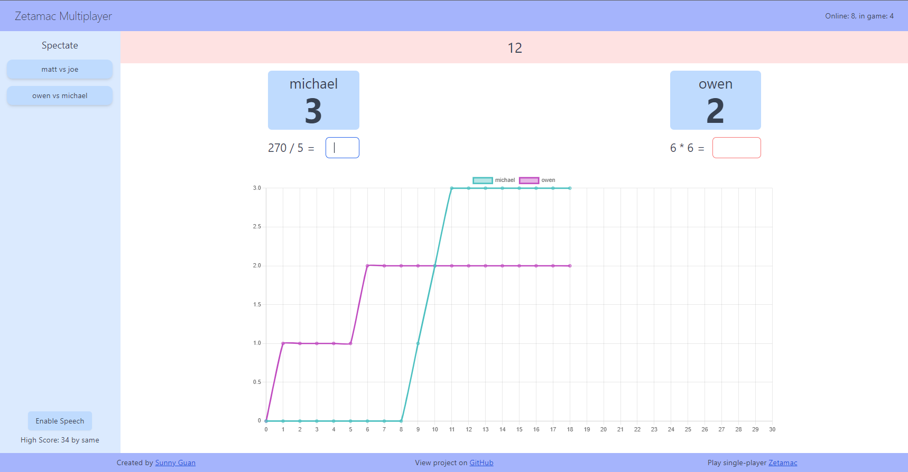

# Multiplayer Zetamac

Currently hosted on [Heroku](http://zetamac.herokuapp.com/). 

Inspiration comes from [Zetamac](http://arithmetic.zetamac.com/), which is a single-player mental math game that tests basic addition, subtraction, multiplication, and division. To make it more exciting, this is a multiplayer version of Zetamac where players can play 1v1 against other players. There is also a spectator mode to view ongoing games. Another cool feature is that you can speak your answers instead of typing, which is thanks to [annyang](https://github.com/TalAter/annyang).

[Socket.io](https://socket.io/) and NodeJS are used for communicating between clients and the server.

Several AWS Lambda functions are [chained together](step_function/step_function.png) with Step Functions to save the game to DynamoDB and update the high score after each game.
